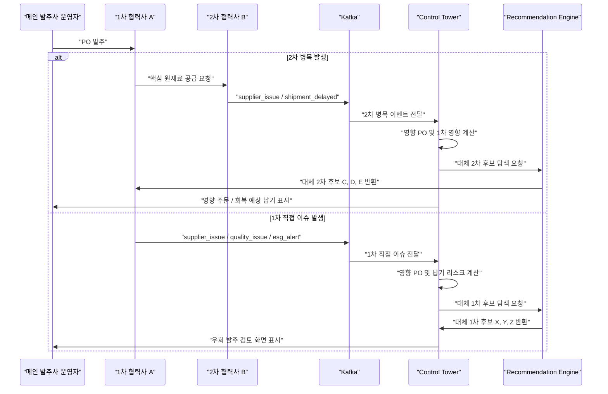
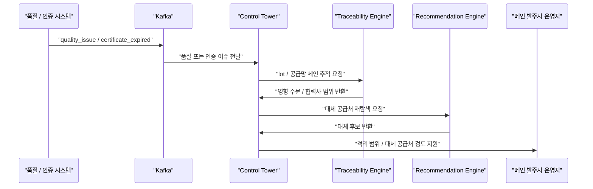
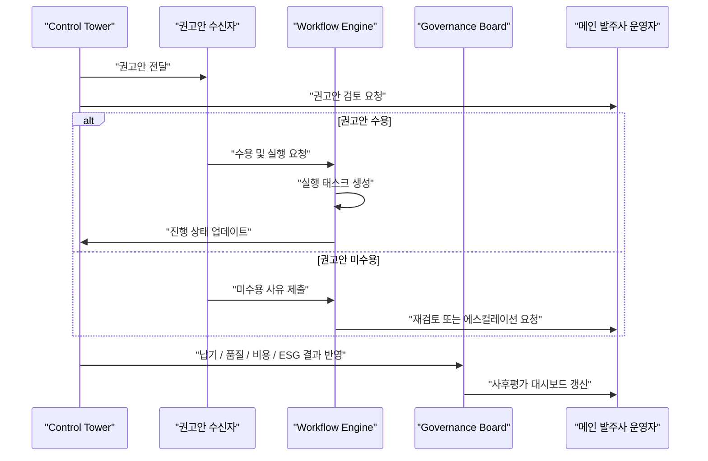
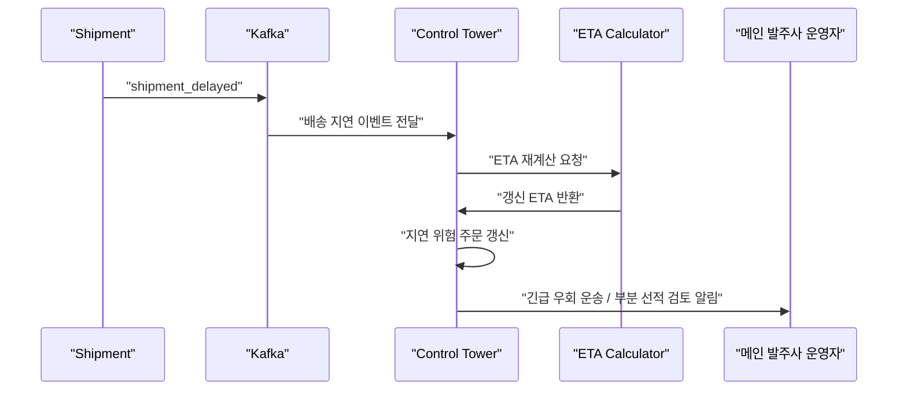
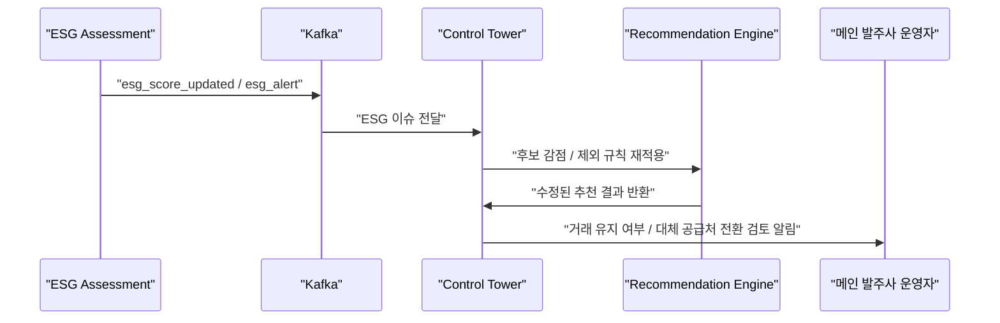
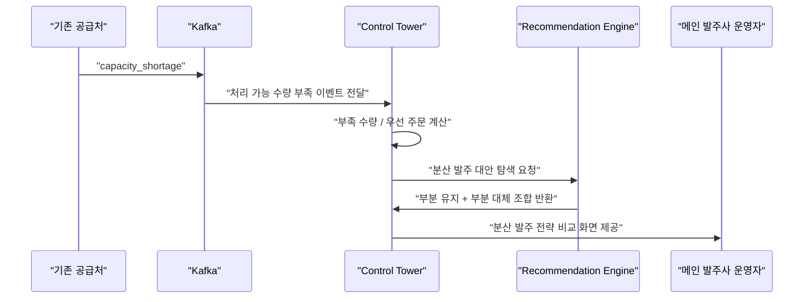

<body>
<main class="container">
  <h1>IDMS - 방산 장비 통합 유지보수 관리 시스템</h1>
  
  

  <hr/>


<div class="card">

  <h2>소개</h2>
    <p>
      IDMS는 Integrated Defense Maintenance System의 약자로서, 방산 장비를 유지보수하기 위해 만들어진 시스템입니다. 각국의 군대는 IDMS를 통해 장비 상태 조회, 고장 이력 관리, 부품 교체 주기 예측, 유지보수 요청 접수까지 한 번에 처리 할 수 있으며, 유지보수가 특별히 중요한 고가의 자산인 방산 자산의 생애주기를 철저히 관리할 수 있습니다.
    </p>
  </div>

<h2 id="toc">목차</h2>
  <div class="toc">
  <a href="#summary">1. 프로젝트 요약</a><br />
  <a href="#project-plan">2. 프로젝트 기획서</a><br />
  <a href="#service-flow">3. 서비스 플로우</a><br />
  <a href="#features">4. 주요 기능 상세</a><br />
  <a href="#documents">5. 기술 문서</a><br />
  </div>

<section id="summary">
<h2>1. 프로젝트 요약</h2>

</section>

<section id="project-plan">
    <h2>2. 프로젝트 기획서</h2>
[프로젝트 기획서](./files/프로젝트 기획서.pdf)
<details>
  <summary><b>문제정의 & 기획의도</b></summary>

  <h4>문제정의</h4>
  <ul>
    <li><strong>업무 분산</strong> - 발주, 재고, 출하, 반품, 정산이 분리 관리됨</li>
    <li><strong>상태 파악 한계</strong> - 공급사별 재고, 수락 여부, 출하 진행 상황 확인 어려움</li>
    <li><strong>데이터 단절</strong> - 발주 이후 재고·출하·반품·정산 흐름이 느슨하게 연결됨</li>
    <li><strong>정합성 문제</strong> - 확정 발주 이후 품목 정보 변경 시 주문 기준 불일치 발생</li>
    <li><strong>식자재 특성</strong> - 원산지, 인증, 유통기한, 보관 조건 등 추적 필요</li>
  </ul>

  <h4>기획의도</h4>
  <ul>
    <li><strong>통합 관리</strong> - 발주부터 정산까지 하나의 업무 흐름으로 연결</li>
    <li><strong>운영 가시화</strong> - 공급 가능 수량, 재고, 출하, 반품 상태를 한눈에 확인</li>
    <li><strong>데이터 정합성</strong> - 확정 발주 이후 품목 수정 제한 등 업무 규칙 반영</li>
    <li><strong>사후 처리 추적</strong> - 반품/교환 사유, 증빙, 검수, 정산 연계 관리</li>
  </ul>

  <p>
    <strong>ATLAS는 발주·재고·출하·반품·정산을 연결하는 운영 중심 SCM 주문 관리 시스템이다.</strong>
  </p>

</details>

<section id="service-flow">
    <h2>3. 서비스 플로우</h2>
    
<div id="order-supply">
<h3> SCM 비즈니스 흐름도 </h3>
    
  <details> 
    <summary><b>흐름 상세</b></summary>

  <ol>
      <li>
        <strong>기준 정보 등록:</strong>
        조직 등록 → 사용자/권한 설정 → 창고 등록 → 품목 카테고리 등록 → 인증서 유형 등록
      </li>
      <li>
        <strong>공급 정보 구성:</strong>
        공급사 등록 → 품목 등록 → 단가·규격·유통기한 입력 → 월간 생산량·주문 가능 수량·MOQ·리드타임 설정 → 인증서/원산지/보관 조건 자료 등록
      </li>
      <li>
        <strong>발주 요청:</strong>
        발주사가 공급사와 품목을 선택 → 요청 수량·납기일 입력 → 발주 생성 → 공급사에게 발주 요청 전달
      </li>
      <li>
        <strong>발주 처리:</strong>
        공급사가 발주 상세 확인 → 수락/반려/부분 확정 처리 → 품목별 확정 수량 입력 → 발주 상태 전환
      </li>
      <li>
        <strong>재고 연동:</strong>
        확정 발주 기준으로 재고 확인 → 품목별/창고별 재고 상태 조회 → 잔여 수량·예약 수량·주문 가능 수량 관리
      </li>
      <li>
        <strong>출하 처리:</strong>
        확정 발주 기반 출하 생성 → 출발/도착 창고 지정 → 배송 상태 및 ETA 관리 → 지도 기반 출하 흐름 확인
      </li>
      <li>
        <strong>납품 이후 처리:</strong>
        납품 완료 후 품질 이슈 또는 수량 불일치 발생 시 반품/교환 요청 → 반품 품목 선택 → 사유 및 증빙 이미지 등록 → 검수 결과 입력 → 교환/폐기/반품 완료 처리
      </li>
      <li>
        <strong>정산:</strong>
        발주·출하·반품 결과를 기반으로 정산 데이터 확인 → 공급사별 정산 금액·기간·상태 관리 → 정산 완료 처리
      </li>
      <li>
        <strong>운영 커뮤니케이션:</strong>
        발주, 출하, 반품, 정산 상태 변경 시 알림 발송 → 발주사와 공급사 간 채팅으로 업무 협의 → 처리 이력 확인
      </li>
    </ol>
     
  </details>
</div>

</section>

<section id="features">
  <h2>4. 주요 기능 상세</h2>

  <details>
    <summary><b>7.1 관리자</b></summary>

  <h4>7.1.1 시스템 운영 관리</h4>
    
    
    
    
    
    <ul>
      <li><strong>전체 업무 현황 관리:</strong> 품목, 발주, 재고, 출하, 반품/교환, 정산 등 공급망 운영 데이터를 관리</li>
      <li><strong>사용자 관리:</strong> 사용자 계정 생성, 조회, 수정, 상태 관리</li>
      <li><strong>권한 관리:</strong> 관리자, 발주사, 공급사 등 사용자 유형에 따른 접근 권한 관리</li>
      <li><strong>기준 정보 관리:</strong> 카테고리, 인증서 유형, 조직 정보 등 공통 기준 데이터 관리</li>
      <li><strong>운영 데이터 추적:</strong> 발주부터 정산까지 업무 단계별 처리 상태와 이력 확인</li>
    </ul>
    
  </details>

  <details>
    <summary><b>7.2 창고</b></summary>

  <h4>7.2.1 창고 관리</h4>
  
    <ul>
      <li><strong>창고 등록:</strong> 창고, 센터, 출발지, 도착지 등 창고 정보 등록</li>
      <li><strong>창고 상세 조회:</strong> 창고명, 주소, 좌표, 담당 조직 등 상세 정보 확인</li>
      <li><strong>창고 수정:</strong> 창고의 기본 정보 및 위치 정보 수정</li>
      <li><strong>출하 연동:</strong> 출하 생성 시 출발 창고과 도착 창고을 연결하여 배송 흐름 관리</li>
      <li><strong>지도 시각화:</strong> 출하 및 물류 흐름을 지도 기반으로 확인</li>
    </ul>
  </details>

  <details>
    <summary><b>7.3 품목</b></summary>

  <h4>7.3.1 카테고리 관리</h4>
  
    <ul>
      <li><strong>카테고리 등록:</strong> 식자재 등 품목 분류 기준 등록</li>
      <li><strong>카테고리 조회:</strong> 품목 생성 및 검색에 사용할 카테고리 목록 제공</li>
      <li><strong>카테고리 상태 관리:</strong> 사용 여부에 따른 카테고리 관리</li>
    </ul>
    

  <h4>7.3.2 품목 관리</h4>
  
      
    <ul>
      <li><strong>품목 등록:</strong> 품목명, 카테고리, 규격, 단위, 단가, 유통기한 등 기본 정보 입력</li>
      <li><strong>품목 상세 조회:</strong> 품목 기본 정보, 공급 정보, 재고 현황, 관련 이미지 확인</li>
      <li><strong>품목 수정:</strong> 상세 페이지에서 수정할 항목만 입력하여 품목 정보 변경</li>
      <li><strong>수정 제한:</strong> 발주 확정까지 진행된 품목은 수정 불가 처리하여 데이터 정합성 확보</li>
      <li><strong>품목 상태 관리:</strong> ACTIVE/DEACTIVE 등 품목 운영 상태 관리</li>
      <li><strong>공급 조건 관리:</strong> 월간 생산량, 주문 가능 수량, 최소 주문 수량, 리드타임 관리</li>
      <li><strong>품목 미디어 관리:</strong> 품목 이미지 및 관련 파일 업로드/조회</li>
    </ul>
      </details>


  <details>
    <summary><b>7.4 재고</b></summary>

  <h4>7.4.1 재고 관리</h4>
  
    
    <ul>
      <li><strong>재고 등록:</strong> 품목, 창고, 제조일, 유통기한, 수량 등 재고 정보 등록</li>
      <li><strong>재고 목록 조회:</strong> 품목별, 창고별, 상태별 재고 목록 확인</li>
      <li><strong>재고 상세 조회:</strong> 특정 재고의 잔여 수량, 예약 수량, 주문 가능 수량, 상태 확인</li>
      <li><strong>재고 수정:</strong> 재고 상세 화면에서 수량, 상태, 보관 정보 등 수정</li>
      <li><strong>품목별 재고 조회:</strong> 품목 상세 화면에서 해당 품목에 연결된 재고만 필터링하여 표시</li>
      <li><strong>유통기한 관리:</strong> 제조일과 유통기한 기반으로 재고 상태 추적</li>
      <li><strong>재고 상태 관리:</strong> 사용 가능, 예약, 출하 대기 등 업무 상태별 재고 관리</li>
    </ul>
  </details>

  <details>
    <summary><b>7.5 발주</b></summary>

  <h4>7.5.1 발주 생성 및 조회</h4>
  
    <ul>
      <li><strong>발주 생성:</strong> 공급사, 품목, 요청 수량, 납기일 등을 입력하여 발주 생성</li>
      <li><strong>발주 목록 조회:</strong> 발주 번호, 발주사, 공급사, 상태, 생성일 기준으로 발주 목록 확인</li>
      <li><strong>발주 상세 조회:</strong> 발주 기본 정보, 발주 품목, 요청 수량, 확정 수량, 처리 상태 확인</li>
      <li><strong>발주 품목 관리:</strong> 하나의 발주에 여러 품목을 연결하여 주문 처리</li>
    </ul>

  <h4>7.5.2 발주 처리</h4>
    
    <ul>
      <li><strong>발주 수락:</strong> 공급사가 요청된 발주를 수락하고 후속 재고/출하 흐름으로 연결</li>
      <li><strong>발주 반려:</strong> 공급 불가 또는 조건 불일치 시 발주 반려 처리</li>
      <li><strong>부분 확정:</strong> 요청 수량 전체를 처리하기 어려운 경우 품목별 확정 수량 입력</li>
      <li><strong>상태 전환 관리:</strong> 요청, 검토, 수락, 반려, 확정 등 발주 처리 상태 관리</li>
      <li><strong>업무 정합성 확보:</strong> 확정된 발주 기준으로 품목 수정 제한 및 후속 업무 연결</li>
    </ul>
  </details>

  <details>
    <summary><b>7.6 출하</b></summary>

  <h4>7.6.1 출하 관리</h4>
  
    
    <ul>
      <li><strong>출하 생성:</strong> 확정된 발주를 기준으로 출하 데이터 생성</li>
      <li><strong>출하 목록 조회:</strong> 출하 번호, 발주 정보, 출발지, 도착지, 상태 기준으로 목록 확인</li>
      <li><strong>출하 상세 조회:</strong> 출하 품목, 출발/도착 창고, 배송 상태, ETA 정보 확인</li>
      <li><strong>출하 상태 관리:</strong> 출하 대기, 배송 중, 납품 완료 등 진행 상태 관리</li>
      <li><strong>창고 연동:</strong> 출발 창고과 도착 창고을 연결하여 물류 흐름 관리</li>
      <li><strong>지도 기반 시각화:</strong> 출하 경로와 창고 정보를 지도 화면에서 확인</li>
    </ul>
  </details>

  <details>
    <summary><b>7.7 반품/교환</b></summary>

  <h4>7.7.1 반품 요청</h4>
  
    
    <ul>
      <li><strong>반품 요청 등록:</strong> 납품 이후 품목 이상, 수량 불일치, 품질 문제 등 반품 사유 입력</li>
      <li><strong>반품 품목 선택:</strong> 발주 또는 출하와 연결된 품목 중 반품 대상 품목 선택</li>
      <li><strong>증빙 파일 첨부:</strong> 반품 사유를 확인할 수 있는 이미지 또는 문서 업로드</li>
      <li><strong>반품 상세 조회:</strong> 반품 요청 정보, 품목, 사유, 증빙 자료, 처리 상태 확인</li>
    </ul>

  <h4>7.7.2 교환 및 처리</h4>
    
    <ul>
      <li><strong>검수 결과 등록:</strong> 반품 품목에 대한 검수 결과와 처리 의견 기록</li>
      <li><strong>처리 방식 결정:</strong> 교환, 폐기, 반품 완료 등 처리 결과 관리</li>
      <li><strong>처리 상태 관리:</strong> 요청, 검수 중, 처리 완료 등 반품/교환 상태 추적</li>
      <li><strong>정산 연동:</strong> 반품/교환 결과가 정산 데이터에 반영될 수 있도록 후속 흐름 연결</li>
    </ul>
  </details>

  <details>
    <summary><b>7.8 정산</b></summary>

   <h4>7.8.1 정산 관리</h4>
   
    
    <ul>
      <li><strong>정산 목록 조회:</strong> 정산 기간, 공급사, 금액, 상태 기준으로 정산 데이터 확인</li>
      <li><strong>정산 상세 조회:</strong> 발주, 출하, 반품 결과와 연결된 정산 상세 정보 확인</li>
      <li><strong>정산 상태 관리:</strong> 대기, 확정, 완료 등 정산 처리 상태 관리</li>
      <li><strong>금액 관리:</strong> 공급 품목, 수량, 단가, 반품/교환 결과를 기반으로 정산 금액 확인</li>
      <li><strong>업무 흐름 연결:</strong> 발주부터 납품, 반품/교환까지의 결과를 정산 단계로 연결</li>
    </ul>
  </details>

  <details>
    <summary><b>7.9 조직관리</b></summary>

  <h4>7.9.1 조직 및 사용자 관리</h4>
  
    
    
    
    
    <ul>
      <li><strong>조직 등록:</strong> 발주사, 공급사 등 공급망 참여 조직 정보 등록</li>
      <li><strong>조직 상세 조회:</strong> 조직명, 유형, 연락처, 주소, 담당자 정보 확인</li>
      <li><strong>조직 수정:</strong> 조직 기본 정보 및 운영 상태 수정</li>
      <li><strong>사용자 연결:</strong> 조직에 소속된 사용자 계정 관리</li>
      <li><strong>역할 기반 관리:</strong> 조직 유형과 사용자 역할에 따라 접근 가능한 업무 범위 구분</li>
    </ul>
  </details>

  <details>
    <summary><b>7.10 알림</b></summary>

  <h4>7.10.1 업무 알림</h4>
  
    <ul>
      <li><strong>발주 알림:</strong> 신규 발주, 발주 수락/반려, 확정 상태 변경 알림</li>
      <li><strong>출하 알림:</strong> 출하 생성, 배송 진행, 납품 완료 등 상태 변경 알림</li>
      <li><strong>반품/교환 알림:</strong> 반품 요청, 검수 결과, 처리 완료 알림</li>
      <li><strong>정산 알림:</strong> 정산 생성, 확정, 완료 등 정산 상태 알림</li>
      <li><strong>메일 연동:</strong> SMTP 기반 이메일 알림 발송</li>
    </ul>
  </details>

  <details>
    <summary><b>7.11 채팅</b></summary>

  <h4>7.11.1 실시간 커뮤니케이션</h4>
  
    <ul>
      <li><strong>업무 채팅:</strong> 발주사와 공급사 간 업무 협의를 위한 채팅 기능</li>
      <li><strong>발주 관련 대화:</strong> 발주 수량, 납기, 출하 일정 등 주문 처리 과정에서 필요한 협의 지원</li>
      <li><strong>상태 공유:</strong> 발주, 출하, 반품/교환 처리 과정의 진행 상황을 대화로 공유</li>
      <li><strong>WebSocket/STOMP 기반:</strong> 실시간 메시지 송수신 구조 지원</li>
    </ul>
  </details>

  <details>
    <summary><b>7.12 인증서</b></summary>

  <h4>7.12.1 공급사 인증서 관리</h4>
  
    
    
    
    <ul>
      <li><strong>인증서 유형 관리:</strong> HACCP, 원산지 증명, 품질 인증 등 인증서 유형 등록 및 관리</li>
      <li><strong>인증서 등록:</strong> 공급사별 인증서 파일 및 인증 정보 등록</li>
      <li><strong>인증서 조회:</strong> 품목 또는 공급사 기준으로 보유 인증서 확인</li>
      <li><strong>인증서 파일 관리:</strong> 인증서 이미지 또는 문서 파일 업로드/조회</li>
      <li><strong>식자재 공급망 검증:</strong> 원산지, 품질, 보관 조건 등 실무 검증에 필요한 자료 관리</li>
    </ul>
  </details>

  <details>
    <summary><b>7.13 프로필</b></summary>

  <h4>7.13.1 사용자 프로필</h4>
  
    
    <ul>
      <li><strong>내 정보 조회:</strong> 로그인한 사용자의 기본 정보, 조직, 권한 확인</li>
      <li><strong>프로필 수정:</strong> 이름, 연락처 등 사용자 기본 정보 수정</li>
      <li><strong>첫 로그인 비밀번호 변경:</strong> 사용자 계정 보안을 위한 비밀번호 변경</li>
      <li><strong>조직 정보 확인:</strong> 사용자가 소속된 발주사 또는 공급사 정보 확인</li>
      <li><strong>업무 접근 정보 확인:</strong> 사용자 권한에 따라 접근 가능한 메뉴와 기능 확인</li>
    </ul>
  </details>
</section>

<section id="documents">
  <h2>5. 기술 문서</h2>
  
  ### 요구사항 명세서 [상세보기](https://docs.google.com/spreadsheets/d/1-9XXxS_f5A81Zk5Z6et8IepxUo-Pm2fp-omdqqYuDvY/edit?gid=0#gid=00)
  <details>
    <summary><b>요구사항 명세서</b></summary>
    
    
    
  </details>

  ### 화면 설계서 [상세보기](https://stitch.withgoogle.com/projects/3858843644991271330)
  <details>
    <summary><b>화면 설계서</b></summary>
    
    
    
  </details>
  
  ### ERD [상세보기](https://www.erdcloud.com/d/CTyFQXjoQ3my9vYvr)
  <details>
    <summary><b>ERD</b></summary>
    
  </details>

  ### WBS [상세보기](https://docs.google.com/spreadsheets/d/1-9XXxS_f5A81Zk5Z6et8IepxUo-Pm2fp-omdqqYuDvY/edit?gid=176847268#gid=176847268)
  <details>
    <summary><b>WBS</b></summary>
    
    
    
    
    
    
    
  </details>

  ### API 명세서 
  <details>
    <summary><b>API 명세 및 문서 링크</b></summary>
<ul>
    <li>
      <a href="https://docs.google.com/spreadsheets/d/1-9XXs_f5A81Zk5Z6et8lepxUo-Pm2fp-omdqqYuDvY/edit?gid=1910787508#gid=1910787508">
        Google Sheets API 명세서
      </a>
    </li>
    <li>
      <a href="https://app.swaggerhub.com/apis-docs/personal-359/atlas-backend-api/0.1.0?view=uiDocs">
        SwaggerHub API 문서
      </a>
    </li>
  </ul>
</details>  
<details>
  <summary><b>API 문서 화면</b></summary>  
  
    
    
    
    
  </details>
</section>


<br/>

<!-- 
<details>
<summary>프로젝트 한눈에 보기</summary>

| 항목 | 내용 |
| --- | --- |
| 캠프 주제 대응 | `3. 공급망 관리를 위한 주문 관리 시스템` |
| 플랫폼 성격 | 범용 공급망 운영 플랫폼 |
| MVP 검증 도메인 | 식자재 공급망 |
| 핵심 가치 | 리스크 감지, 권고안 생성, 실행 추적, 사후평가, 협력사 거버넌스 |

## 해결하려는 문제

| 문제 | 설명 |
| --- | --- |
| 병목 원인 파악 지연 | 메인 발주사는 1차 협력사 지연만 보게 되고 실제 병목 원인이 2차, 3차에 있어도 빠르게 파악하기 어렵다. |
| 대체 공급처 판단 지연 | 공급 차질이 발생했을 때 어떤 대체 공급처를 연결해야 하는지 판단이 늦어진다. |
| 정보 분산 | 협력사 간 관계, 납기 성과, 품질 상태, ESG 상태, 인증 정보가 흩어져 있어 대응 속도가 느리다. |
| 거버넌스 약화 | 권고안을 제시하더라도 실제 수용 여부와 결과를 추적하지 않으면 공급망 거버넌스가 약해진다. |

## 핵심 기능

| 기능 | 설명 |
| --- | --- |
| 공급 차질 대응 오케스트레이션 | 공급 차질 이벤트를 수집하고 영향 PO와 납기 리스크를 계산한다. 이슈 tier에 따라 대체 2차 또는 대체 1차 권고안을 생성한다. |
| 품질/인증 이슈 추적 및 대체 공급처 검토 | lot 기반 추적, 영향 범위 식별, 격리 여부 판단을 지원한다. 필요 시 대체 공급처를 다시 탐색한다. |
| 권고안 이행 및 사후평가 거버넌스 | 권고안 수용/미수용과 미수용 사유를 기록한다. 실행 상태, 납기 회복 여부, 품질 결과, 비용 영향, ESG 영향을 사후평가에 반영한다. |

## 시나리오

| 구분 | 설명 |
| --- | --- |
| 메인 시나리오 1 | 공급 차질 발생 시 대체 공급처 권고안 오케스트레이션 |
| 메인 시나리오 2 | 품질 또는 인증 이슈 기반 lot 추적 및 대체 공급처 검토 |
| 메인 시나리오 3 | 권고안 이행 및 사후평가 거버넌스 |
| 보조 시나리오 | 물류 지연, ESG 기준 미달 |
| 확장 시나리오 | Capacity 부족 / 분산 발주 |

<details>
<summary>상세 시나리오 보기</summary>

### 메인 시나리오 1: 공급 차질 발생 시 대체 공급처 권고안 오케스트레이션

1. 메인 발주사가 1차 협력사 A에 특정 품목 발주를 넣는다.
2. 공급망에서 병목 또는 직접 이슈가 발생한다.
3. 시스템은 이벤트 유형을 분류하고 영향을 받는 PO와 납기 리스크를 계산한다.
4. 이슈 위치에 따라 권고안 대상을 다르게 잡는다.
5. 2차 병목이면 1차 협력사에게 대체 2차 후보를 제시한다.
6. 1차 직접 이슈이면 메인 발주사에게 대체 1차 후보를 제시한다.
7. 운영자는 권고안 점수, 사유, 예상 회복 납기를 확인하고 다음 의사결정을 시작한다.

#### 메인 시나리오 1 흐름도

```mermaid
flowchart TB
A["공급 차질 또는<br/>직접 이슈 발생"] ->  B["Kafka<br/>이벤트 수집"]
A -> C["이슈 위치 / 유형<br/>분류"]
B -> D["영향 PO 및<br/>납기 리스크 계산"]
C -> D
D -> E{"어느 tier가<br/>문제인가"}
E ->|"2차 병목"| F["1차 대상<br/>대체 2차 후보 탐색"]
E ->|"1차 직접 이슈"| G["메인 발주사 대상<br/>대체 1차 후보 탐색"]
F -> H["권고안 점수화 /<br/>회복 납기 비교"]
G -> H
H -> I["권고안 확인 및<br/>의사결정 시작"]
```

#### 메인 시나리오 1



### 메인 시나리오 2: 품질 또는 인증 이슈 기반 lot 추적 및 대체 공급처 검토

1. 특정 lot에서 품질 이슈가 발생하거나 인증서가 만료된다.
2. 시스템은 해당 lot와 연결된 주문 및 협력사 체인을 추적한다.
3. 시스템은 영향 범위를 계산하고 격리 필요 lot를 식별한다.
4. 운영자는 대체 공급처 검토 또는 lot 격리 조치를 판단한다.
5. 필요하면 추천 엔진이 대체 가능한 1차 또는 2차 후보를 다시 탐색한다.

#### 메인 시나리오 2 흐름도

```mermaid
flowchart TB
A["품질 이슈 또는<br/>인증 만료"] -> B["lot / 공급망 체인<br/>추적"]
A -> C["인증 상태 /<br/>문서 확인"]
B -> D["영향 주문 및<br/>협력사 범위 식별"]
C > E["lot 격리 여부<br/>판단"]
D -> F["대체 공급처<br/>검토"]
E -> F
F -> G["격리 / 전환 / 유지<br/>의사결정"]
```

#### 메인 시나리오 2



### 메인 시나리오 3: 권고안 이행 및 사후평가 거버넌스

1. 시스템이 리스크 대응 권고안을 생성한다.
2. 권고안 수신자는 수용 또는 미수용 여부를 결정한다.
3. 미수용 시 사유를 입력하고, 필요하면 운영자가 재검토나 에스컬레이션을 진행한다.
4. 수용 시 시스템은 우회 발주, 공급처 전환, lot 격리, 긴급 운송 같은 실행 태스크를 생성한다.
5. 실행 상태는 진행 중, 완료, 실패 단위로 추적된다.
6. 이후 납기 회복 여부, 품질 결과, 비용 영향, ESG 영향까지 사후평가에 반영한다.

#### 메인 시나리오 3 흐름도

```mermaid
flowchart TB
A["권고안 생성"] -> B["수용 / 미수용<br/>결정"]
B ->|"수용"| C["실행 태스크 생성"]
B ->|"미수용"| D["미수용 사유 기록 /<br/>재검토"]
C -> E["실행 상태 추적"]
D -> E
E -> F["납기 / 품질 / 비용 / ESG<br/>사후평가"]
F -> G["권고안 성과 축적 /<br/>거버넌스 대시보드 반영"]
```

#### 메인 시나리오 3



### 보조 시나리오

#### 1. 물류 지연 시나리오

1. 항만 또는 내륙운송 단계에서 `shipment_delayed` 이벤트가 발생한다.
2. 시스템은 ETA를 재계산하고 납기 위험 주문을 갱신한다.
3. 운영자는 긴급 우회 운송, 부분 선적, 대체 공급처 검토 여부를 판단한다.

##### 보조 시나리오 1 흐름도

```mermaid
flowchart TB
A["shipment_delayed<br/>발생"] -> B["ETA 재계산"]
A -> C["배송 이슈<br/>기록"]
B -> D["지연 위험 주문<br/>갱신"]
C -> E["우회 운송 옵션<br/>탐색"]
D -> F["운영자 판단"]
E -> F
```

##### 보조 시나리오 1



#### 2. ESG 기준 미달 시나리오

1. 특정 협력사의 ESG 점수가 임계값 아래로 하락하거나 중대 이슈가 발생한다.
2. 시스템은 해당 협력사를 신규 추천에서 제외하거나 강하게 감점한다.
3. 운영자는 기존 거래 유지 여부와 대체 공급처 전환 필요성을 검토한다.

##### 보조 시나리오 2 흐름도

```mermaid
flowchart TB
A["ESG 점수 하락<br/>또는 중대 이슈"] -> B["후보 감점 /<br/>제외 규칙 적용"]
A -> C["ESG 이슈<br/>등록"]
B -> D["추천 결과<br/>재계산"]
C -> E["기존 거래<br/>유지 여부 검토"]
D -> F["대체 공급처<br/>전환 판단"]
E -> F
```

##### 보조 시나리오 2



### 확장 시나리오

#### 1. Capacity 부족 / 분산 발주 시나리오

1. 기존 1차 또는 2차 협력사가 품질 문제는 없지만 전체 주문 수량을 모두 소화하지 못한다.
2. 시스템은 부족 수량과 우선 납기 주문을 계산한다.
3. 시스템은 기존 공급처 유지 물량과 대체 공급처 분산 물량 조합을 제안한다.
4. 운영자는 전량 전환이 아니라 `부분 유지 + 부분 대체` 전략을 검토한다.

##### 확장 시나리오 흐름도

```mermaid
flowchart TB
A["공급 capacity 부족"] -> B["부족 수량 계산"]
A -> C["우선 납기 주문 식별"]
B -> D["대체 공급처 분산안 생성"]
C -> D
D -> E["부분 유지 + 부분 대체<br/>전략 비교"]
E -> F["분산 발주 의사결정"]
```

##### 확장 시나리오



</details>

## 차별화 포인트

| 포인트 | 설명 |
| --- | --- |
| 운영 흐름 완결성 | 단순 주문 관리가 아니라 `리스크 감지 -> 권고안 생성 -> 실행 추적 -> 사후평가`까지 연결한다. |
| 다단계 분석 | 공급망 네트워크 기반으로 1차, 2차, 3차 병목을 분석한다. |
| 정책 반영 | ESG와 인증 정보를 권고안 점수에 반영한다. |
| 거버넌스 강화 | 협력사별 수용률과 회복 성과를 관리해 공급망 거버넌스를 강화한다. |
| 확장성 | 블록체인, 디지털 트윈 Lite, AI 고도화, MSA 확장까지 연결 가능한 구조를 가진다. |

## MVP 범위

| 구분 | 내용 |
| --- | --- |
| 운영 화면 | 메인 발주사 기준 Control Tower |
| 공급망 가시화 | 1차, 2차, 3차 Supplier Network 시각화 |
| 이벤트 처리 | 이벤트 기반 병목 감지 |
| 분석 | 영향 주문 계산 |
| 권고안 | 대체 2차 / 대체 1차 권고안 생성 |
| 거버넌스 | 권고안 수용/미수용 기록, 사후 결과 평가 |
| 정책 | ESG 점수 1차 버전 |

## 기술 스택

| 영역 | 기술 |
| --- | --- |
| Backend | `Java 17`, `Spring Boot 3.5`, `Spring Cloud Gateway`, `Spring Security`, `JWT`, `Spring Data JPA`, `Spring Batch` |
| Frontend | `Vue 3`, `TypeScript`, `Vite`, `Pinia`, `Vue Router`, `Axios` |
| Realtime | `WebSocket`, `STOMP`, `SockJS` |
| Data | `MariaDB`, `PostgreSQL`, `Redis`, `Elasticsearch` |
| Event | `Kafka` |
| File/Map | `AWS S3 SDK`, `Thumbnailator`, `MapLibre GL`, `jsVectorMap`, `PDF.js` |
| Infra | `Docker`, `Kubernetes`, `AWS ALB`, `CloudFront`, `S3` |
| CI/CD | `GitHub Actions` |

## 기능 영역별 최종 적용 기술

| 기능 영역 | 최종 적용 기술 | 적용 방향 |
| --- | --- | --- |
| 인증/권한 | `JWT 심화` | 메인 발주사 운영자, 1차 협력사 담당자, 관리자 역할을 분리한다. |
| 주문/공급망 기준 데이터 관리 | `Spring Data JPA` | 품목, 공급업체, 발주, 재고, 출하, 반품, 정산 등 주요 도메인 데이터를 서비스별 DB에서 관리한다. |
| 이벤트 기반 리스크 오케스트레이션 | `Kafka` | `supplier_issue`, `shipment_delayed`, `quality_issue`, `esg_alert` 같은 이벤트를 기반으로 오케스트레이션을 수행한다. |
| 실시간 대시보드/알림 | `WebSocket/STOMP` | Control Tower 실시간 상태 반영과 권고안 생성/이슈 알림을 화면에 즉시 전달한다. |
| 배치/집계 | `Spring Batch` | 유통기한 임박 계산, 협력사 납기 준수율, 권고안 수용률, 회복 성공률을 주기적으로 집계한다. |
| 메인 DB/보조 저장소 | `MariaDB`, `PostgreSQL` | Auth, Supply, File 서비스는 MariaDB를 사용하고, Control 서비스는 PostgreSQL을 사용해 서비스별 데이터 소유권을 분리한다. |
| 캐시 | `Redis` | 대시보드 수치, 최근 권고안, 세션/토큰 보조 데이터를 캐싱한다. |
| 검색 최적화 | `Elasticsearch` | 공급처, 품목, lot, 인증서, 이력 검색을 최적화한다. |
| CI/CD | `GitHub Actions` | 자동 테스트, 빌드, 배포 파이프라인을 구성한다. |
| 배포 인프라 | `Docker`, `Kubernetes` | 컨테이너 기반 배포와 운영 환경을 구성한다. |
| 파일/첨부 처리 | `AWS S3 SDK`, `Thumbnailator` | 파일 업로드와 첨부파일 저장, 이미지 썸네일 생성을 처리한다. |
| 아키텍처 | `이벤트 기반 분리 구조` | 운영형 워크플로우 중심으로 서비스를 느슨하게 분리하고, 추후 MSA로 확장 가능하게 설계한다. |

### 최종 채택 요약

| 구분 | 기술 |
| --- | --- |
| 우선 채택 | `JWT`, `Spring Data JPA`, `Kafka`, `WebSocket/STOMP`, `Spring Batch`, `Elasticsearch`, `GitHub Actions` |
| 여유 있으면 채택 | `Prometheus + Grafana` |

### 팀 회의 반영 포인트

| 제안자 | 회의 반영 내용 | 연결되는 기술/기능 |
| --- | --- | --- |
| 정윤 | 문서/인증 만료 사전 경고 기능을 강화하고, 사전 예방형 리스크 관리 축과 검색 기능 고도화를 함께 고려한다. | `Spring Batch`, `Elasticsearch`, 문서/인증 만료 경고 |
| 병찬 | 대안 권고와 추적 항목을 더 세분화하고, 여러 벤더와 원활히 소통할 수 있도록 채팅 기능을 검토한다. | 권고안 이행 추적, `WebSocket/STOMP`, 채팅 기능 |
| 강현&도균 | 이슈 해결에 가장 적합한 업체를 추천하는 로직과, 이슈 현황 및 납기 영향을 보여주는 대시보드 축을 강화한다. | 추천 로직, `Kafka`, `Spring Data JPA`, Control Tower 대시보드 |
| 태환 | 적합 업체 추천 고도화를 검토하고, 채팅 또는 메일 시스템, 발주 시 문서 첨부 및 전자계약/인증 흐름까지 확장 가능성을 본다. | `WebSocket/STOMP`, `Spring Mail`, `AWS S3 SDK`, 문서 첨부 |

## 트렌드 및 사례

| 구분 | 내용 | 링크 |
| --- | --- | --- |
| 트렌드 1 | 글로벌 기업들은 1차 공급처만이 아니라 다단계 공급망과 물류 흐름을 함께 보는 방향으로 확장하고 있다. |  |
| 트렌드 2 | Control Tower에 AI, 디지털 트윈, 실시간 ETA, ESG 데이터를 결합하는 흐름이 강화되고 있다. |  |
| PepsiCo | Siemens·NVIDIA와 함께 공장·창고·end-to-end supply chain을 AI와 디지털 트윈으로 전환하는 협업을 공식 발표했다. | [PepsiCo 공식](https://www.pepsico.com/newsroom/press-releases/2025/pepsico-announces-industry-first-ai-and-digital-twin-collaboration-with-siemens-and-nvidia) |
| Coca-Cola HBC | Shippeo를 통해 실시간 운송 가시성과 ETA 공유를 도입하고 SAP 및 기존 시스템과의 연동을 공식 자료에서 강조했다. | [Coca-Cola HBC 공식](https://www.coca-colahellenic.com/content/dam/cch/us/documents/media/news/CCHBC%20enables%20real-time%20delivery%20tracking%20for%20customers%20by%20partnering%20with%20Shippeo_Press%20Release.pdf.downloadasset.pdf) |
| Zespri | SAP `S/4HANA`, `IBP`, `Sustainability Control Tower` 기반 공급망 디지털 전환 확대 사례로 소개됐다. | [SAP 공식](https://news.sap.com/sea/2024/10/zespri-upgrades-sap-s-4hana-digital-core-and-begins-next-stage-of-supply-chain-digital-transformation/) |

## 기대 효과

| 항목 | 설명 |
| --- | --- |
| 운영 효율 향상 | 병목 발생 시 원인 파악과 대응 결정 시간을 줄인다. |
| 납기 리스크 완화 | 영향 주문을 빠르게 식별하고 회복 가능한 대안을 제시한다. |
| 품질/인증 대응 강화 | lot 추적과 인증 검증을 통해 품질 리스크 대응력을 높인다. |
| 협력사 거버넌스 강화 | 권고안 수용률과 사후 결과를 관리해 공급망 대응 기준을 표준화한다. |
| 확장 가능성 확보 | 블록체인, 디지털 트윈 Lite, AI 고도화, MSA 확장까지 자연스럽게 연결할 수 있다. |

</details>

<details>
<summary>요구사항명세서</summary>

[요구사항 명세서](https://docs.google.com/spreadsheets/d/1-9XXxS_f5A81Zk5Z6et8IepxUo-Pm2fp-omdqqYuDvY/edit?gid=0#gid=0)

</details>

<details>
<summary>ERD</summary>


</details>

<details>
<summary>디자인</summary>

<a href="https://stitch.withgoogle.com/projects/3858843644991271330">
  
</a>

이미지를 클릭하면 Google Stitch 프로젝트로 이동한다.
직접 열기: [Google Stitch](https://stitch.withgoogle.com/projects/3858843644991271330)
</details>

<details>
<summary>프로그램 사양서 및 단위테스트결과서</summary>

클릭 -> [Swagger hub link](https://app.swaggerhub.com/apis-docs/personal-359/atlas-backend-api/0.1.0 ) 

## Swagger / OpenAPI

Spring Boot 애플리케이션 실행 후 서비스별 Swagger UI는 아래 경로로 접근한다.

| 서비스 | Swagger UI | OpenAPI JSON |
| --- | --- | --- |
| auth-service | `/api/auth/swagger-ui.html` | `/api/auth/v3/api-docs` |
| supply-service | `/api/supply/swagger-ui.html` | `/api/supply/v3/api-docs` |
| control-service | `/api/control/swagger-ui.html` | `/api/control/v3/api-docs` |
| file-service | `/api/files/swagger-ui.html` | `/api/files/v3/api-docs` |

참고:

- `auth-service` 문서에는 JWT Bearer 인증 스키마가 포함된다.
- 일부 공급망 컨트롤러는 `ResponseEntity<?>`를 사용하므로 응답 스키마가 문서에서 일반 `object`로 보일 수 있다.
- `supply-service`, `control-service`, `file-service`의 일부 엔드포인트는 API Gateway가 전달하는 `X-Organization-Public-Id`, `X-User-Public-Id` 헤더를 사용한다.
- SwaggerHub 업로드용 통합 스펙 초안 파일은 [docs/openapi/atlas-backend-openapi.json](/Users/iamxoghks/Documents/GitHub/be23-fin-team1-Atlas-be/docs/openapi/atlas-backend-openapi.json)에 둔다.
- SwaggerHub 문서형 페이지는 [atlas-backend-api docs](https://app.swaggerhub.com/apis-docs/personal-359/atlas-backend-api/0.1.0?view=uiDocs)에서 확인한다.
- 이 통합 스펙은 소스 컨트롤러 기준 초안이라, 운영 전에는 예시값과 응답 스키마를 보강하는 것을 권장한다.


</details>
-->
</main>
</body>
</html>
